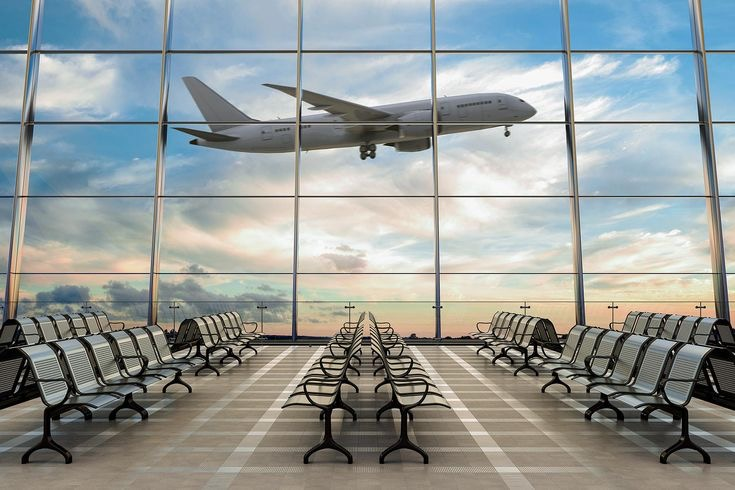

# Dano Airline Passenger Satisfacion

## Introduction
For this challenge, I be assuming the role of a Data Analyst for Dano Airlines *disclaimer* it is a fictional Company, a Uk-based airline headquartered in London, United Kingdom. The latest passenger survey results just came in and it looks like the satisfaction rate dipped under 50% for the first time ever. The leadership team needs to take action fast, so they've brought you in to analyze the data and find the key areas to focus on for getting back on track.

## Data Source

To gain access to the data set used for this analysis, [click here](https://docs.google.com/spreadsheets/d/15Kp-2yfQFNRGJPNOkpMwG-OMX8xVZOJ5VL7f35v7sRQ/edit#gid=1647986900)

## Tools
1. Power Bi
2. Visualization Tools

## Skills
1. Data transformation
2. Query editor
3. Dax
4. slicers
5. Data visualization.

## Processes

Before visualizing data in Power BI, the following steps were undertaken:

1. *Data Import:* Data was imported from various sources into Power BI, including Excel files, CSV files, databases, or online services.

2. *Data Cleaning and Transformation:* The imported data was cleaned and transformed using Power Query Editor. This involved tasks such as removing duplicates, filtering rows, correcting data types, handling missing values, and performing other data cleansing operations to ensure data accuracy and consistency.

3. *Data Modeling:* Although not explicitly creating a data model, some level of data modeling were involved. Which included grouping columns, creating new calculated columns using DAX expressions, defining relationships between tables, and organizing data in a way that facilitates analysis.

4. *DAX Calculations:* DAX expressions were utilized to create new measures or calculated columns based on specific business requirements. These measures could include aggregations, calculations, or transformations needed for analysis and reporting.

5. *Grouping Columns:* Columns were grouped together to create hierarchies or to organize data for better visualization and analysis.

6. *Dashboard Creation:* Dashboards were designed to present key metrics and insights in a visually appealing and interactive manner. This involved arranging visualizations, adding slicers or filters for interactivity, and configuring the layout to convey information effectively.

7. *Identifying Data Types:* Data types were identified for each column to ensure proper interpretation and formatting of data during analysis and visualization.

By performing these steps, the data was prepared, transformed, and organized in Power BI to facilitate meaningful analysis and visualization, leading to the creation of insightful dashboards and reports.

## Visualization

 

 ## Results and Findings

*Total Average Flight Distance:* 1,190 kilometers
*Average Departure Delay:* 14.71 minutes
*Average Arrival Delay:* 15.09 minutes

### Customer Satisfaction:
1. Business class passengers indicated higher satisfaction levels with cleanliness and gate location, whereas economy class passengers expressed the lowest satisfaction levels.
   
2. Adults generally found online boarding and online booking processes easier compared to children.
   
3.  Returning passengers tended to be more satisfied with in-flight entertainment and WiFi services, while first-time travelers showed lower satisfaction levels.
   
4.  Business class passengers reported higher satisfaction with legroom and seat comfort, while passengers in the economy plus category were least satisfied.
   
5. Across different classes and travel types, business class passengers consistently exhibited the highest satisfaction levels.
 
6. Returning passengers displayed higher satisfaction with food and drink services.
   
7.  Overall, adults demonstrated higher satisfaction levels compared to children.
   
18. Additionally, age data was aggregated, and a new table called "age_range" was created to facilitate age-based analysis.

[Click here](https://github.com/AmaPrecious/Dano_Airline_passenger_satisfacion/blob/main/AIRLINE%20SERVICE%20SATISFACTION%20DASBOARD.pbix) to gain access to the interactive dashboard.

## Conclusion:

In conclusion, the analysis of the airline passenger feedback data reveals several key insights regarding flight experience satisfaction. Business class passengers generally exhibit higher satisfaction levels across various aspects such as cleanliness, gate location, legroom, and seat comfort. In contrast, economy class passengers express lower satisfaction levels in these areas. Additionally, returning passengers tend to be more satisfied with in-flight entertainment, WiFi services, and food and drink offerings compared to first-time travelers. Furthermore, adults typically report higher satisfaction levels than children, suggesting potential areas for improvement in catering to younger passengers. 

## *Recommendations:*

1. *Enhance Economy Class Amenities:* To address the lower satisfaction levels among economy class passengers, consider investing in improvements such as seat comfort, cleanliness, and in-flight entertainment options. Implementing regular cleaning routines and upgrading seating options can contribute to a more comfortable experience for passengers.

2. *First-Time Traveler Engagement:* Develop targeted initiatives to improve the experience for first-time travelers, such as providing clear guidance on online booking and boarding processes. Creating informative resources and offering assistance during the booking and boarding stages can help alleviate anxieties and enhance satisfaction.

3. *Child-Friendly Services:* Recognize the specific needs of younger passengers by offering child-friendly amenities and entertainment options. This could include dedicated play areas, kid-friendly meals, and onboard activities to keep children engaged and entertained during the flight.

4. *Continuous Monitoring and Improvement:* Implement a system for collecting and analyzing passenger feedback regularly to identify emerging trends and areas for improvement. By actively monitoring satisfaction levels and addressing passenger concerns promptly, airlines can continually enhance the overall travel experience and maintain customer loyalty.

By implementing these recommendations, airlines can strive to improve passenger satisfaction levels across all classes and travel types, ultimately leading to enhanced customer loyalty and retention.
